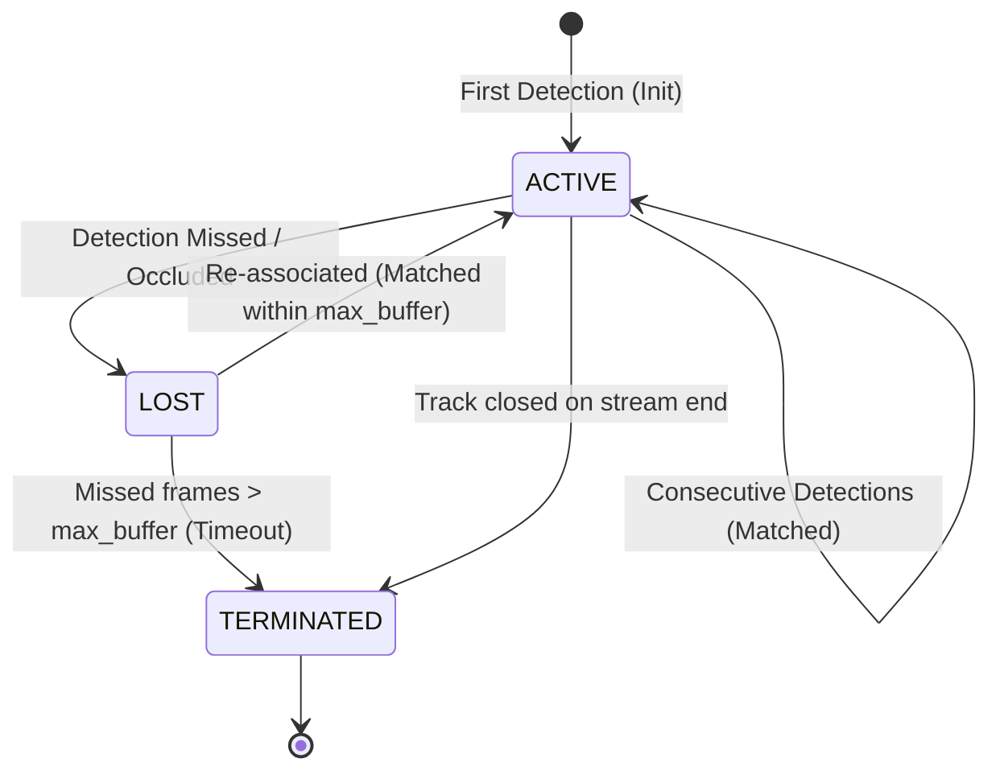

# VIDEX Architecture: Detection & Tracking (Perception Foundation)

## 1. Overview & Architectural Boundary

Phase 2.0 establishes the perception layer for VIDEX, connecting deterministic video ingestion to temporal object detection and multi-object tracking.

```text
                  VIDEO
                    │
                    ▼
         ┌─────────────────────┐
         │   Video Ingestion   │
         │ (OpenCVVideoReader) │
         └──────────┬──────────┘
                    │  DecodedFrame (frame_array, frame_index, FrameTimestamp)
                    ▼
         ┌─────────────────────┐
         │  DetectionProvider  │ ──► [YOLO26 / MockDetector]
         └──────────┬──────────┘
                    │  Detection[] (bbox, conf, class_id, first-class FrameTimestamp)
                    ▼
         ┌─────────────────────┐
         │  TrackingProvider   │ ──► [BoT-SORT / MockTracker]
         └──────────┬──────────┘
                    │  Track[] + TrajectoryPoint[] (ACTIVE / LOST / TERMINATED)
                    ▼
         ┌─────────────────────┐
         │ TrajectoryAnalyzer  │ (Pixel displacement, path length, pixel velocity, cardinal directions)
         └──────────┬──────────┘
                    │
                    ▼
          Perception Evidence (EvidenceType.TRACK & EvidenceType.VISUAL_DETECTION)
                    │
                    ▼
              Evidence Graph
```

---

## 2. Core Perception Principles

### 2.1 The Golden Rule of Temporal Integrity: First-Class Timestamp Provenance
The detector and tracker must **never invent their own timestamps**.
- Every `DecodedFrame` produced by `VideoReader` carries an authoritative, immutable `FrameTimestamp` object containing:
  - `pts_seconds`: Authoritative Presentation Timestamp in seconds.
  - `frame_index`: Sequential zero-based frame index.
  - `timestamp_source`: Explicit provenance (`TimestampSource.CONTAINER` vs `TimestampSource.DERIVED`).
  - `is_repaired`: Boolean flag indicating whether container timestamp jitter or reordering was sanitized.
  - `repair_reason`: Explanation of timestamp repair (e.g. `backward_pts`, `missing_pts`, `duplicate_pts`, `interpolated`).
  - `original_pts_seconds`: Raw un-repaired container PTS when repaired.
- **Detection Observation Timestamp Provenance**:
  - `Detection.frame_timestamp`: Stores the authoritative `FrameTimestamp` object directly as a first-class field.
  - Convenience numeric `timestamp_seconds` is synchronized from `frame_timestamp.pts_seconds`.
  - Downstream consumers access container vs derived status and repair flags without parsing attributes or recomputing timestamps.
- **Track Observation Timestamp Provenance**:
  - `TrajectoryPoint.frame_timestamp`: Inherits the authoritative `FrameTimestamp` from the frame and detection observations.
  - Tracks and trajectory points preserve exact temporal provenance throughout the track lifecycle without loss or floating-point drift.

### 2.2 DTS vs PTS in Perception Streams
Understanding the separation of codec decode timing from video perception presentation timing is critical when working with modern compressed video:
- **DTS (Decode Timestamp)**: Governs the sequence in which compressed packets are fed into the video decoder. For video streams containing B-frames (bi-directionally predicted frames), packets must be decoded out of display order because B-frames depend on both prior and subsequent reference frames (I/P-frames). In demux packet order, `packet.dts` is monotonic, while `packet.pts` jumps forward and backward.
- **PTS (Presentation Timestamp)**: Governs the chronological presentation order in which frames are rendered to a viewer or analyzed by computer vision models. Decoded video frames emitted by FFmpeg / OpenCV are strictly ordered by presentation order (monotonic PTS).
- **Perception Subsystem Rule**: Object detectors and multi-object trackers operate strictly in **presentation space (PTS)**. Demux packet DTS must never be conflated with frame PTS. Test suites and validation harnesses explicitly assert monotonic DTS in packet decode order and strictly increasing PTS in frame presentation order.

### 2.3 Pixel-Space Kinematics (No Physical Speed Claims)
Unless explicit multi-camera spatial calibration or ground-plane homography is established:
- **Never claim physical speed** (e.g. km/h, mph, m/s).
- All motion analysis is calculated strictly in **pixel space**:
  - `total_displacement_px`: Net Euclidean distance between initial and final centroids.
  - `path_length_px`: Cumulative sum of frame-to-frame pixel displacements.
  - `mean_pixel_velocity`: Average displacement in pixels per second (`px/s`).
  - `direction_cardinal`: Cardinal motion direction in screen coordinate space (`right`, `down-right`, `down`, `down-left`, `left`, `up-left`, `up`, `up-right`, or `stationary`).

---

## 3. Provider Contracts

The perception subsystem strictly decouples high-level pipelines from deep learning runtimes via Python protocols (`typing.Protocol` with runtime checkability):

### 3.1 DetectionProvider
```python
@runtime_checkable
class DetectionProvider(Protocol):
    @property
    def provider_name(self) -> str: ...
    def detect(
        self, frame_data: bytes | DecodedFrame, frame_meta: Frame | None = None
    ) -> list[Detection]: ...
    def detect_batch(
        self, batch: list[tuple[bytes | DecodedFrame, Frame | None]]
    ) -> list[list[Detection]]: ...
    def warmup(self) -> None: ...
```

- **Concrete Implementations**:
  - `YOLO26Detector`: Production detector adapter with configurable model weights (`yolo26n.pt`), confidence thresholds, IoU thresholds, CPU/GPU device selection, and optional polygon segmentation masks. Ultralytics is dynamically imported to allow zero-weight testing in lightweight CI environments.
  - `MockDetector`: Deterministic, zero-dependency detector allowing programmable canned detections and confidence filtering for hermetic testing.

### 3.2 TrackingProvider
```python
@runtime_checkable
class TrackingProvider(Protocol):
    @property
    def provider_name(self) -> str: ...
    def update(
        self, detections: list[Detection], frame_meta: Frame | DecodedFrame
    ) -> list[TrajectoryPoint]: ...
    def active_tracks(self) -> list[Track]: ...
    def reset(self) -> None: ...
```

- **Concrete Implementations**:
  - `BoTSORTTracker`: Custom lightweight implementation of the BoT-SORT algorithm.
  - `MockTracker`: Lightweight deterministic tracker supporting strict track lifecycles (`ACTIVE` $\rightarrow$ `LOST` $\rightarrow$ `TERMINATED`), centroid history, and association tests without OpenCV or deep learning dependencies.

---

## 4. BoT-SORT Implementation & Verification

VIDEX provides a qualified, lightweight implementation of BoT-SORT (`BoTSORTTracker`) tailored for high-throughput video indexing. To ensure absolute engineering fidelity, each algorithmic component of BoT-SORT is accounted for:

| Algorithmic Component | Status | Implementation Details |
|---|---|---|
| **Motion Prediction (Kalman Filter)** | **Implemented** | 8-dimensional linear constant-velocity Kalman filter tracking state $(x_c, y_c, w, h, v_{xc}, v_{yc}, v_w, v_h)$. Predicts track bounding boxes forward on every frame, preserving spatial continuity through detector dropouts and occlusions. |
| **Association** | **Implemented** | Two-stage IoU association. Stage 1 associates active tracks with high-confidence detections ($conf \ge track\_high\_thresh$). Stage 2 associates unmatched tracks with low-confidence detections ($track\_low\_thresh \le conf < track\_high\_thresh$) to prevent track fragmentation. |
| **Track Buffer & Lifecycle** | **Implemented** | Configurable lost-track window (`track_buffer`, default 30 frames). Tracks transition from `ACTIVE` to `LOST` upon detector misses and only become `TERMINATED` after `track_buffer` consecutive missed frames. Re-association during the lost window preserves original `track_id`. |
| **Camera Motion Compensation (CMC)** | **Configured / Modular Hook** | Configuration parameter `cmc_method` provided (default `"sparseOptFlow"`). In lightweight hermetic mode, operates with identity transform; external affine/homography warp matrices can be passed without altering tracker interfaces. |
| **Re-Identification (ReID)** | **Configured / Modular Hook** | Configuration parameter `with_reid` provided (default `False`). Deep visual appearance embedding extraction is decoupled to avoid forcing multi-gigabyte neural weight downloads in CI environments. In lightweight mode, association operates purely in motion and spatial IoU space. |

### 4.1 Motion Model Mathematical Classification: Linear Kalman Filter vs. EKF

An important precision detail in multi-object tracking literature is distinguishing between linear and extended formulations:
- **VIDEX Motion Model**: Strictly an **8-Dimensional Linear Kalman Filter (KF)**.
- **Verification via Equations**:
  1. **Linear State Dynamics**: The state vector is $\mathbf{x} = [x_c, y_c, w, h, v_{xc}, v_{yc}, v_w, v_h]^T$. The state transition is strictly linear: $\mathbf{x}_k = F \mathbf{x}_{k-1} + \mathbf{w}_k$, where $F = I_8$ with upper-right $4 \times 4$ identity block representing $\Delta t \cdot I_4$.
  2. **Linear Measurement Projection**: The measurement vector is $\mathbf{z} = [x_c, y_c, w, h]^T$. The projection is strictly linear: $\mathbf{z}_k = H \mathbf{x}_k + \mathbf{v}_k$, where $H = [I_4 \mid 0_{4 \times 4}]$.
  3. **No Non-linear Equations or Jacobians**: There is no non-linear state mapping $f(\mathbf{x})$ or measurement mapping $h(\mathbf{x})$, and no Jacobian calculation ($\frac{\partial f}{\partial \mathbf{x}}$ or $\frac{\partial h}{\partial \mathbf{x}}$).
  4. While measurement and process covariance matrices ($R$ and $Q$) are dynamically scaled proportional to bounding box dimensions $(w, h)$, all prediction, innovation, Kalman gain, and covariance updates follow standard linear Kalman algebra.
  5. Describing this filter as an "Extended Kalman Filter" (EKF) would be mathematically incorrect. It is properly designated as an **8D Linear Kalman Filter**.

---

## 5. Track Lifecycle State Machine

Tracks transition through three formal states:



1. **ACTIVE**: Object identity is confirmed and actively observed in the current frame window.
2. **LOST**: Object was not matched in the current frame (e.g. occlusion or temporary detector miss). The tracker projects its bounding box forward using the Kalman filter velocity state and awaits re-association within `track_buffer` frames.
3. **TERMINATED**: Object has remained unobserved for longer than `track_buffer` frames. Its identity is permanently closed and converted to a consolidated `Track` domain record.

---

## 6. Evidence Generation & Graph Traceability

For every confirmed track and high-confidence detection, the `PerceptionPipeline` compiles structured `Evidence` objects:
- `evidence_type = EvidenceType.TRACK` or `EvidenceType.VISUAL_DETECTION`
- `video_id`, `track_id`, and `frame_number` identifiers linking back to source frames
- `timestamp_seconds`: Start timestamp preserving frame PTS
- `raw_payload`: Full trajectory kinematic summary (displacement, path length, mean velocity, cardinal direction) and first/last seen metadata
- `supporting_observation_ids`: List of individual detection UUIDs contributing to the track

This structure guarantees that any forensic query or downstream temporal reasoning agent can inspect the exact pixels, bounding boxes, and timestamp provenance underlying every perception claim.
